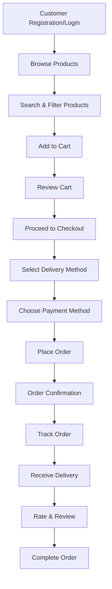
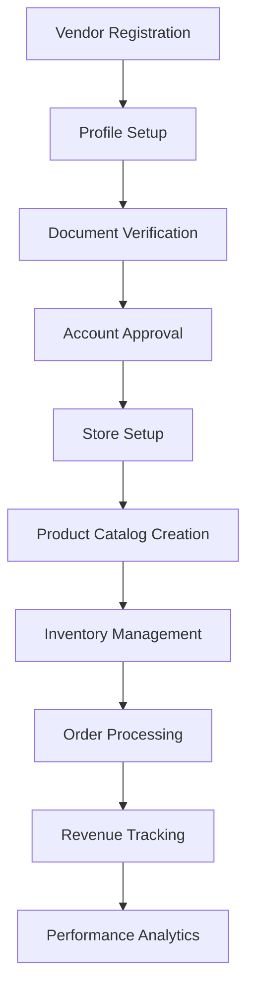
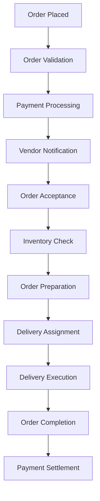

# 🏪 Grozzery - Business Logic Diagram

This document provides a comprehensive overview of the business logic, workflows, and user journeys for the Grozzery multi-vendor grocery delivery platform.

## 📊 **System Architecture Overview**

```
┌─────────────────────────────────────────────────────────────────────────────────┐
│                           GROZZERY PLATFORM                                    │
├─────────────────────────────────────────────────────────────────────────────────┤
│                                                                                 │
│  ┌─────────────┐    ┌─────────────┐    ┌─────────────┐    ┌─────────────┐     │
│  │   CUSTOMER  │    │    VENDOR   │    │   PLATFORM  │    │   DELIVERY  │     │
│  │   PORTAL    │    │   PORTAL    │    │  ADMIN      │    │   SYSTEM    │     │
│  └─────────────┘    └─────────────┘    └─────────────┘    └─────────────┘     │
│                                                                                 │
└─────────────────────────────────────────────────────────────────────────────────┘
```

## 🔄 **Core Business Workflows**

### **1. Customer Journey Flow**



### **2. Vendor Onboarding & Management Flow**



### **3. Order Processing Flow**



## 🛍️ **Shopping Experience Workflow**

### **Product Discovery & Selection**

```
┌─────────────────────────────────────────────────────────────────────────────────┐
│                           PRODUCT DISCOVERY FLOW                               │
├─────────────────────────────────────────────────────────────────────────────────┤
│                                                                                 │
│  1. Homepage Display                                                           │
│     ├── Featured Products                                                      │
│     ├── Special Offers                                                         │
│     ├── Category Navigation                                                    │
│     └── Search Bar                                                            │
│                                                                                 │
│  2. Product Search                                                             │
│     ├── Text Search                                                            │
│     ├── Category Filter                                                        │
│     ├── Price Range Filter                                                     │
│     ├── Vendor Filter                                                          │
│     └── Rating Filter                                                          │
│                                                                                 │
│  3. Product Display                                                            │
│     ├── Product Images                                                         │
│     ├── Product Details                                                        │
│     ├── Variants & Options                                                     │
│     ├── Pricing Information                                                    │
│     ├── Stock Status                                                           │
│     └── Customer Reviews                                                       │
│                                                                                 │
│  4. Product Actions                                                            │
│     ├── Add to Cart                                                            │
│     ├── Add to Wishlist                                                        │
│     ├── View Vendor Profile                                                    │
│     └── Contact Vendor                                                         │
└─────────────────────────────────────────────────────────────────────────────────┘
```

### **Shopping Cart Management**

```
┌─────────────────────────────────────────────────────────────────────────────────┐
│                           SHOPPING CART FLOW                                   │
├─────────────────────────────────────────────────────────────────────────────────┤
│                                                                                 │
│  1. Cart Operations                                                            │
│     ├── Add Product                                                            │
│     ├── Update Quantity                                                        │
│     ├── Remove Product                                                         │
│     ├── Save for Later                                                         │
│     └── Clear Cart                                                             │
│                                                                                 │
│  2. Cart Validation                                                            │
│     ├── Stock Availability                                                     │
│     ├── Price Updates                                                          │
│     ├── Vendor Availability                                                    │
│     └── Delivery Zone Check                                                    │
│                                                                                 │
│  3. Cart Summary                                                               │
│     ├── Item Count                                                             │
│     ├── Subtotal                                                               │
│     ├── Shipping Cost                                                          │
│     ├── Tax Calculation                                                        │
│     └── Total Amount                                                           │
└─────────────────────────────────────────────────────────────────────────────────┘
```

## 🚚 **Delivery System Workflow**

### **Delivery Method Selection**

```
┌─────────────────────────────────────────────────────────────────────────────────┐
│                           DELIVERY SYSTEM FLOW                                 │
├─────────────────────────────────────────────────────────────────────────────────┤
│                                                                                 │
│  1. Address-Based Delivery                                                     │
│     ├── Select Saved Address                                                   │
│     ├── Add New Address                                                       │
│     ├── Address Validation                                                     │
│     ├── Fixed Shipping Cost                                                    │
│     └── Standard Delivery Time                                                 │
│                                                                                 │
│  2. Location-Based Delivery                                                    │
│     ├── Interactive Map Selection                                              │
│     ├── GPS Coordinates Capture                                                │
│     ├── Address Autocomplete                                                   │
│     ├── Distance-Based Pricing                                                │
│     └── Dynamic Delivery Time                                                  │
│                                                                                 │
│  3. Delivery Calculation                                                       │
│     ├── Base Shipping Cost                                                     │
│     ├── Distance Multiplier                                                    │
│     ├── Zone-Based Pricing                                                     │
│     ├── Vendor-Specific Rates                                                  │
│     └── Total Delivery Cost                                                    │
└─────────────────────────────────────────────────────────────────────────────────┘
```

### **Order Fulfillment Process**

```
┌─────────────────────────────────────────────────────────────────────────────────┐
│                           ORDER FULFILLMENT FLOW                               │
├─────────────────────────────────────────────────────────────────────────────────┤
│                                                                                 │
│  1. Order Processing                                                           │
│     ├── Order Validation                                                       │
│     ├── Payment Authorization                                                  │
│     ├── Vendor Assignment                                                      │
│     ├── Inventory Reservation                                                  │
│     └── Order Confirmation                                                    │
│                                                                                 │
│  2. Vendor Operations                                                          │
│     ├── Order Notification                                                     │
│     ├── Order Acceptance                                                       │
│     ├── Product Preparation                                                    │
│     ├── Quality Check                                                          │
│     └── Ready for Pickup                                                       │
│                                                                                 │
│  3. Delivery Execution                                                         │
│     ├── Delivery Assignment                                                    │
│     ├── Route Optimization                                                     │
│     ├── Real-time Tracking                                                     │
│     ├── Delivery Confirmation                                                  │
│     └── Customer Signature                                                     │
└─────────────────────────────────────────────────────────────────────────────────┘
```

## 💳 **Payment & Financial Workflow**

### **Payment Processing**

```
┌─────────────────────────────────────────────────────────────────────────────────┐
│                           PAYMENT PROCESSING FLOW                              │
├─────────────────────────────────────────────────────────────────────────────────┤
│                                                                                 │
│  1. Payment Method Selection                                                   │
│     ├── Credit/Debit Card                                                     │
│     ├── PayPal                                                                │
│     ├── Cash on Delivery                                                      │
│     └── Digital Wallets                                                       │
│                                                                                 │
│  2. Payment Processing                                                        │
│     ├── Payment Gateway Integration                                           │
│     ├── Transaction Authorization                                             │
│     ├── Fraud Detection                                                       │
│     ├── Payment Confirmation                                                  │
│     └── Receipt Generation                                                    │
│                                                                                 │
│  3. Financial Settlement                                                       │
│     ├── Platform Commission                                                   │
│     ├── Vendor Payout                                                         │
│     ├── Delivery Fee                                                          │
│     ├── Tax Collection                                                        │
│     └── Refund Processing                                                     │
└─────────────────────────────────────────────────────────────────────────────────┘
```

## 🏪 **Vendor Management Workflow**

### **Vendor Operations**

```
┌─────────────────────────────────────────────────────────────────────────────────┐
│                           VENDOR OPERATIONS FLOW                               │
├─────────────────────────────────────────────────────────────────────────────────┤
│                                                                                 │
│  1. Product Management                                                         │
│     ├── Add New Products                                                      │
│     ├── Update Product Details                                                │
│     ├── Manage Inventory                                                      │
│     ├── Set Pricing                                                           │
│     ├── Product Categories                                                    │
│     └── Product Variants                                                      │
│                                                                                 │
│  2. Order Management                                                           │
│     ├── View New Orders                                                       │
│     ├── Accept/Reject Orders                                                  │
│     ├── Update Order Status                                                   │
│     ├── Process Orders                                                        │
│     ├── Track Order History                                                   │
│     └── Handle Returns                                                        │
│                                                                                 │
│  3. Business Analytics                                                         │
│     ├── Sales Reports                                                          │
│     ├── Revenue Tracking                                                      │
│     ├── Customer Analytics                                                    │
│     ├── Performance Metrics                                                   │
│     └── Growth Analysis                                                       │
└─────────────────────────────────────────────────────────────────────────────────┘
```

## 🔐 **Security & Authentication Workflow**

### **User Authentication**

```
┌─────────────────────────────────────────────────────────────────────────────────┐
│                           AUTHENTICATION FLOW                                  │
├─────────────────────────────────────────────────────────────────────────────────┤
│                                                                                 │
│  1. User Registration                                                          │
│     ├── Email Verification                                                     │
│     ├── Phone Verification                                                     │
│     ├── Profile Creation                                                       │
│     ├── Address Setup                                                          │
│     └── Account Activation                                                     │
│                                                                                 │
│  2. User Login                                                                │
│     ├── Credential Validation                                                 │
│     ├── Two-Factor Authentication                                             │
│     ├── Session Management                                                     │
│     ├── Role Assignment                                                        │
│     └── Access Control                                                         │
│                                                                                 │
│  3. Security Measures                                                          │
│     ├── Password Encryption                                                    │
│     ├── CSRF Protection                                                        │
│     ├── SQL Injection Prevention                                              │
│     ├── XSS Protection                                                         │
│     └── Rate Limiting                                                          │
└─────────────────────────────────────────────────────────────────────────────────┘
```

## 📱 **User Experience Workflow**

### **Customer Support & Feedback**

```
┌─────────────────────────────────────────────────────────────────────────────────┐
│                           CUSTOMER SUPPORT FLOW                                │
├─────────────────────────────────────────────────────────────────────────────────┤
│                                                                                 │
│  1. Issue Reporting                                                           │
│     ├── Order Issues                                                           │
│     ├── Product Problems                                                       │
│     ├── Delivery Complaints                                                    │
│     ├── Payment Issues                                                         │
│     └── Technical Support                                                      │
│                                                                                 │
│  2. Feedback System                                                           │
│     ├── Product Reviews                                                        │
│     ├── Vendor Ratings                                                         │
│     ├── Delivery Experience                                                    │
│     ├── Platform Feedback                                                      │
│     └── Improvement Suggestions                                                │
│                                                                                 │
│  3. Resolution Process                                                         │
│     ├── Ticket Creation                                                        │
│     ├── Issue Classification                                                   │
│     ├── Escalation Process                                                     │
│     ├── Resolution Tracking                                                    │
│     └── Customer Satisfaction                                                  │
└─────────────────────────────────────────────────────────────────────────────────┘
```

## 🔄 **Data Flow Architecture**

### **System Integration Points**

```
┌─────────────────────────────────────────────────────────────────────────────────┐
│                           DATA FLOW ARCHITECTURE                               │
├─────────────────────────────────────────────────────────────────────────────────┤
│                                                                                 │
│  ┌─────────────┐    ┌─────────────┐    ┌─────────────┐    ┌─────────────┐     │
│  │   FRONTEND  │◄──►│   BACKEND   │◄──►│  DATABASE   │◄──►│  EXTERNAL   │     │
│  │   (Blade)   │    │  (Laravel)  │    │   (MySQL)   │    │    APIs     │     │
│  └─────────────┘    └─────────────┘    └─────────────┘    └─────────────┘     │
│         │                   │                   │                   │         │
│         ▼                   ▼                   ▼                   ▼         │
│  ┌─────────────┐    ┌─────────────┐    ┌─────────────┐    ┌─────────────┐     │
│  │   SESSION   │    │   CACHE     │    │   STORAGE   │    │   PAYMENT   │     │
│  │  (Redis)    │    │  (Redis)    │    │   (Local)   │    │  GATEWAYS   │     │
│  └─────────────┘    └─────────────┘    └─────────────┘    └─────────────┘     │
│                                                                                 │
└─────────────────────────────────────────────────────────────────────────────────┘
```

## 📊 **Business Rules & Constraints**

### **Core Business Rules**

```
┌─────────────────────────────────────────────────────────────────────────────────┐
│                           BUSINESS RULES                                       │
├─────────────────────────────────────────────────────────────────────────────────┤
│                                                                                 │
│  1. Order Processing Rules                                                     │
│     ├── Minimum order value: $10.00                                           │
│     ├── Maximum delivery distance: 50km                                       │
│     ├── Order cancellation: Within 1 hour                                     │
│     ├── Refund processing: 3-5 business days                                 │
│     └── Delivery time: 1-3 hours                                              │
│                                                                                 │
│  2. Vendor Rules                                                               │
│     ├── Commission rate: 15% on orders                                        │
│     ├── Minimum payout: $50.00                                                │
│     ├── Payout frequency: Weekly                                               │
│     ├── Quality rating: Minimum 4.0 stars                                     │
│     └── Response time: Within 30 minutes                                      │
│                                                                                 │
│  3. Customer Rules                                                             │
│     ├── Account verification required                                          │
│     ├── Multiple addresses allowed                                             │
│     ├── Wishlist limit: 100 items                                             │
│     ├── Review period: 7 days after delivery                                  │
│     └── Return window: 24 hours                                               │
└─────────────────────────────────────────────────────────────────────────────────┘
```

## 🎯 **Key Performance Indicators (KPIs)**

### **Business Metrics**

```
┌─────────────────────────────────────────────────────────────────────────────────┐
│                           BUSINESS KPIs                                        │
├─────────────────────────────────────────────────────────────────────────────────┤
│                                                                                 │
│  1. Customer Metrics                                                           │
│     ├── Customer Acquisition Cost (CAC)                                       │
│     ├── Customer Lifetime Value (CLV)                                         │
│     ├── Customer Retention Rate                                                │
│     ├── Average Order Value (AOV)                                             │
│     └── Customer Satisfaction Score                                           │
│                                                                                 │
│  2. Operational Metrics                                                        │
│     ├── Order Fulfillment Rate                                                 │
│     ├── Average Delivery Time                                                  │
│     ├── Vendor Response Time                                                   │
│     ├── Order Accuracy Rate                                                    │
│     └── Platform Uptime                                                       │
│                                                                                 │
│  3. Financial Metrics                                                          │
│     ├── Gross Merchandise Value (GMV)                                         │
│     ├── Platform Revenue                                                       │
│     ├── Vendor Commission                                                      │
│     ├── Delivery Revenue                                                       │
│     └── Profit Margins                                                         │
└─────────────────────────────────────────────────────────────────────────────────┘
```

## 🔄 **Workflow Summary**

### **Complete Business Process Flow**

```
┌─────────────────────────────────────────────────────────────────────────────────┐
│                           COMPLETE BUSINESS FLOW                               │
├─────────────────────────────────────────────────────────────────────────────────┤
│                                                                                 │
│  CUSTOMER JOURNEY:                                                             │
│  Register → Browse → Search → Filter → Add to Cart → Checkout → Payment →      │
│  Order Confirmation → Track → Receive → Review → Complete                      │
│                                                                                 │
│  VENDOR JOURNEY:                                                               │
│  Register → Verify → Setup → Catalog → Orders → Process → Fulfill →            │
│  Track → Analytics → Payout                                                    │
│                                                                                 │
│  PLATFORM OPERATIONS:                                                          │
│  User Management → Order Processing → Payment → Delivery → Analytics →         │
│  Commission → Support → Maintenance                                            │
│                                                                                 │
│  DELIVERY SYSTEM:                                                              │
│  Order Assignment → Route Planning → Pickup → Delivery → Confirmation →        │
│  Payment Settlement                                                            │
└─────────────────────────────────────────────────────────────────────────────────┘
```

## 📈 **Future Enhancements & Scalability**

### **Planned Business Features**

```
┌─────────────────────────────────────────────────────────────────────────────────┐
│                           FUTURE ENHANCEMENTS                                  │
├─────────────────────────────────────────────────────────────────────────────────┤
│                                                                                 │
│  1. Advanced Features                                                          │
│     ├── AI-powered product recommendations                                     │
│     ├── Predictive inventory management                                        │
│     ├── Dynamic pricing algorithms                                             │
│     ├── Real-time delivery tracking                                            │
│     └── Voice-enabled shopping                                                 │
│                                                                                 │
│  2. Business Expansion                                                        │
│     ├── Multi-city operations                                                  │
│     ├── International expansion                                                │
│     ├── B2B partnerships                                                       │
│     ├── White-label solutions                                                  │
│     └── API marketplace                                                        │
│                                                                                 │
│  3. Technology Upgrades                                                        │
│     ├── Mobile app development                                                 │
│     ├── Progressive Web App (PWA)                                             │
│     ├── Blockchain integration                                                 │
│     ├── IoT device integration                                                 │
│     └── Machine learning optimization                                         │
└─────────────────────────────────────────────────────────────────────────────────┘
```

---

## 📋 **Business Logic Summary**

The Grozzery platform operates as a **multi-sided marketplace** connecting customers, vendors, and delivery partners through a sophisticated business logic system:

### **Core Business Model:**
- **Commission-based revenue** from vendor transactions
- **Delivery fee collection** for location-based services
- **Subscription models** for premium vendor features
- **Advertising revenue** from featured product placements

### **Key Differentiators:**
- **Flexible delivery options** (address-based vs. location-based)
- **Real-time inventory management** with vendor integration
- **Dynamic pricing** based on distance and demand
- **Multi-vendor aggregation** for customer convenience

### **Operational Excellence:**
- **Automated order processing** with minimal human intervention
- **Real-time tracking** and communication systems
- **Quality assurance** through customer feedback loops
- **Performance optimization** through data analytics

This business logic diagram provides a comprehensive view of how the Grozzery platform operates as a complete e-commerce ecosystem, ensuring smooth operations across all business processes while maintaining scalability and user experience excellence.

---

**Last updated: August 2025**
